This is kinda the transcript of the final presentation of my Bachelor&rsquo;s Thesis. It&rsquo;s really meant to be &ldquo;spoken out&rdquo; but to summarize what have I done, I also decided to post it here. A PDF version of the file can be found [here](final-pres-english.pdf).

---

*Note: I originally wrote the whole thing in German. I was, however, too lazy to translate it so I used some random site for that. I&rsquo;ve fixed some of the things but&#x2026; you know.* Translated with [DeepL](https://www.deepl.com/translator). Hello, my name is Stanislav and today I present the results of my Bachelor thesis.

# Motivation

First of all, a brief comment on the motivation. There are many applications where you want to measure something. This is where sensor measurement networks come into play. In our case the network is heterogeneous, it contains sensors of different qualities. By &ldquo;different qualities&rdquo; we mean that the &ldquo;good&rdquo; sensors deliver precise and reliable data (and we know that for fact). On the other hand, we cannot make any statements about the &ldquo;bad&rdquo; sensors. We don&rsquo;t know what kind of values they deliver.

This raises some interesting questions:

-   can you use the bad sensors to predict the values of the good ones?
-   Can you identify the particularly bad sensors in the network?

And how did we try to achieve these goals? By studying some stochastic regression models and using the so-called Feature Importance technique.

# Data

In order to concretize the problem, we also say something about the concrete data. It&rsquo;s about a measuring network of fine dust sensors in Stuttgart. There are two types of sensors.

-   3 sensors of high quality. The data of these sensors are provided by LUBW.
-   in addition there is also a network of numerous cheap DIY sensors whose data can be found publicly on luftdaten.info.

Regarding period - we have considered the year 2017.

All sensors provide two types of values - *PM10* and *PM2.5*. These are different characteristics with which fine dust is described.

There were a lot of problems with the data. For example, the air data sensors measure every minute, but the LUBW deliver averaged values over 30 minutes. That&rsquo;s why we have to synchronize it. We have decided to choose three different averaging intervals so that we can see how the results vary accordingly. We examined daily averages, 12 hours averages and one hour averages. That is, from the data we have generated 3 sets in the end.

Remark to station *SAKP* - the data of it were not complete. For the first 3/4 of the year we should interpolate the fine dust values. We still looked at the sensor so that we could see what bad and wrong results were observed.

# System

Roughly speaking, what did we want to build?

Using data from all other sensors, we want to predict the particulate matter values from one of the LUBW sensors. We always look at the case where we use data from the past to predict values in the future. As I said, the LUBW sensors are the reliable ones, so we consider them as ground truth.

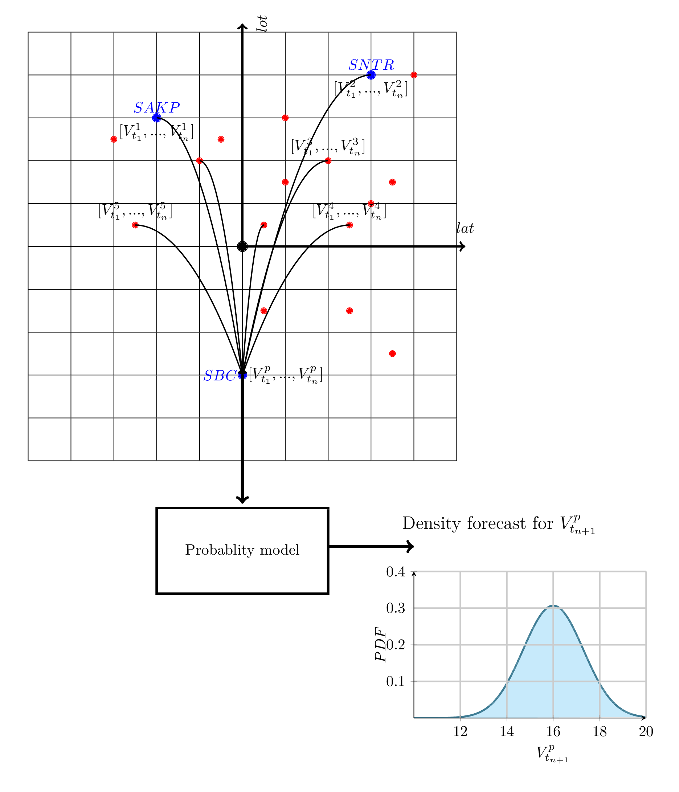

# Goals and not goals

With our goals, we assume that we do not have a large amount of data. Therefore, our goal was not to build the best model for the case, but rather to show that the models studied are better than a baseline. Our work is explorative in this sense. We have not tweaked the hyperparameters of the models to get the best results, but selected the models firmly and said &ldquo;Ok, we investigate what kind of results they can achieve&rdquo;.

The other goal was to find out the relevant features for the models. Here&rsquo;s an asterisk. Why? The importance of a Fe The importance of a feature is only in the context of the corresponding model. You can&rsquo;t really say &ldquo;this sensor is unimportant in reality&rdquo;. It may be unimportant only for the model that uses it. On the other hand, if a sensor is consistently seen by some models as unimportant, then we can at least assume &ldquo;Ok, there&rsquo;s something going on with the sensor&rdquo;.

# Stochastic Regression Models

What exactly are stochastic regression models? Regression models (i.e., you try to predict a real value) that generate a probability distribution for each input point. So, in these models, the actual observation is modelled by distribution. Note that the distribution is generated for each input point. This can be seen here. This is an example for such a model.

The blue curve is the sine function and the big blue points are the observation of it, so with these the model is trained. Then the model is evaluated at every point. The thick red curve is the expected value of the distribution. In addition, however, there are certain probabilities everywhere that the observation is there. You can see, the distributions are wider in the areas far away from the observations. There the model is uncertain what the value of the function is.

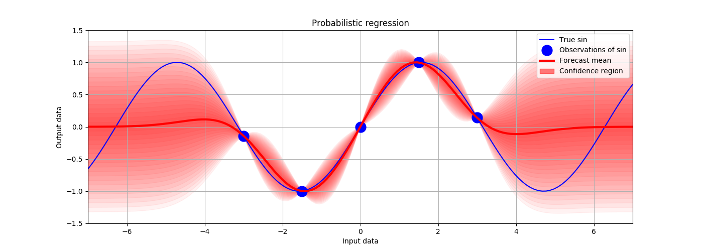

## Concrete models

Which concrete stochastic regression models have we examined?

### BNN

Firstly, Bayesian neural networks. Very similar to ordinary neural networks, but the weights are probability distributions. In our case - normal distribution. In order to evaluate the net with an input point, one must first draw a realization from this distribution and then perform the forward propagation. If you do this N times with the same input point, you have drawn N values from the generated distribution. So, with BNNs you don&rsquo;t get the distribution explicitly, but in the form of many drawn realizations. 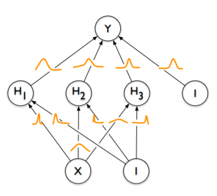

### MDN

Mixture Density Networks. Here you have a mixture of weighted distributions. In our case these are normal distributions. The weights of the mixture are called mixing coefficiants. Each individual distribution has its own parameters - in our case expected value and variance. The parameters and the mixing coefficiants are functions of the input and these functions are modeled by a neural net. One then trains the net so that the probability is maximized by the observations.

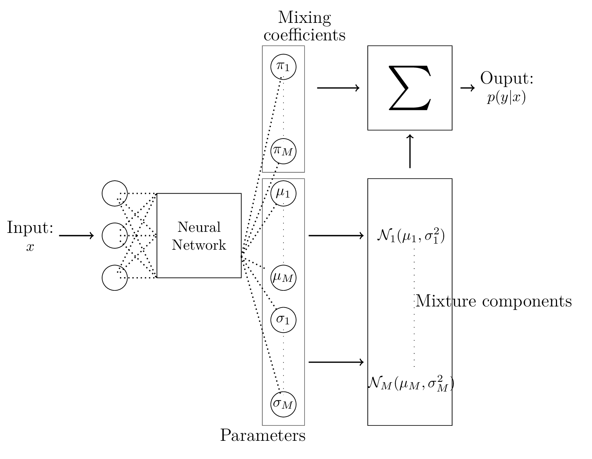

Again, as I said, we are not looking for the most suitable model. We want to investigate certain models that are interesting for us, so that we know for the future &ldquo;Ok on this data, it works, it doesn&rsquo;t work&rdquo;.

### Empirical Model

This is a very simple model that we use as a baseline. So we hope that the BNNs and MDNs are better than this. In the empirical model, you only use the previous values from one sensor to predict the future values of the same sensor - so no features from the whole network. The values from the past are regarded as realizations of a random variable. With this you can close a distribution for the future.

# Evaluation of probability distributions

Now we come to the question of how to compare a predicted distribution and a real observation at all. For this we use special metrics. From the images we see the obvious differences to a point estimate. The blue line is the actual observation we want to predict. Below is a pure point estimate, where you can really only see the distance in between. If the prediction is a distribution, this is not the case. You can make more expressive statements here.

## Proper Scoring Rules

Our special evaluation metrics are the &ldquo;Proper Scoring Rules&rdquo;. They measure the error between a distribution and an observation. &ldquo;Proper&rdquo; because the &ldquo;Proper property&rdquo; applies. Namely - the real distribution must get the smallest error value. Here we look only at a Porper scrolling rule - CRPS or Continuous Rank Probability Score. CRPS generalizes the mean absolute error between a point estimate and a real value. The scoring rule considers the whole distribution and not just one specific point of it. The image shows intuitively how CRPS is calculated. The value of CRPS is the square of the blue area here.

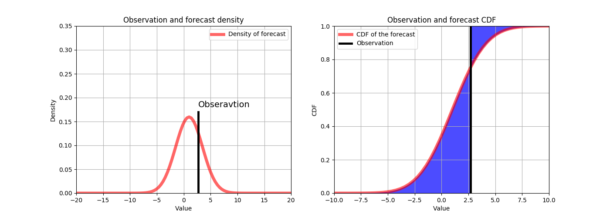

## Verification Rank Histograms

Verification rank histograms are a stuff for visual evaluation of the generated distributions. The intuition - if the distribution is &ldquo;good&rdquo;, the observation behaves as a random realization drawn from the distribution. For this, one generates many samples from the distribution, sorts them and looks at where the observation lies, in which interval. You do this for all examined observations in the test set and accumulate the results in a histogram. If the histogram is uniformly distributed, it can be said that the observations do not differ as much as the samples from the distribution. This is also illustrated here.

-   if this is the kind of observation I mean, the histogram is uniform.
-   if the distributions are too concentrated around the observations, then you can notice this peak in the histogram.
-   the peak is at the side if the distribution is not so close to the observations.

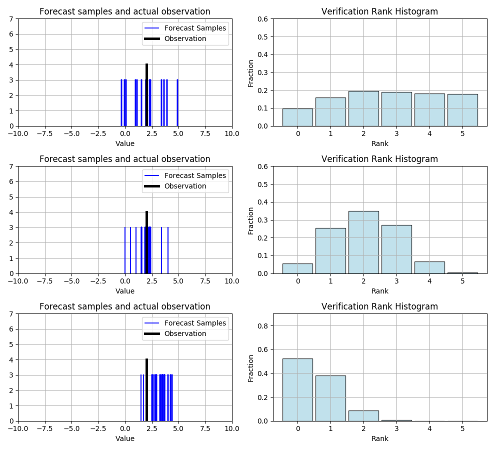

## Feature importance

This is used to evaluate how much information a certain feature brings to the corresponding model. How is this done - You vary the input data (feature per feature) and remember the Änderuńg in the middle CRPS score. In other words, we notice how much worse the error gets when a feature is &ldquo;broken&rdquo;. If the change is big, then we conclude that the corresponding feature gets a lot of information for the model and the model attaches great importance to the feature. If the change is small, the feature is of minor importance to the model.

**Important** - This measures the information content of the feature only in the context of the model!

Also, the model must be reasonably &ldquo;good&rdquo; to trust the Feature Importance results.

# Training

Training was generally quite complicated. There were many independent criteria on how to train a model and we wanted to investigate all possible combinations. The criteria are:

-   Predicted LUBW Station
-   Averaging interval of data - we have said we have 3 sets of data.
-   Use of the other LUBW sensors. We predict one sensor, but the other two are used as features.
-   Particulate matter value - PM10 or PM2.5
-   Model type - We have a total of two MDNs and one BNN uterus. In addition there is the empirical model

Training was done on the SDIL platform with 140 cores. BNNs were nevertheless difficult to train. Average rate - 3 to 4 BNNs per day trained and evaluated. In comparison, all MDNs were ready for 3 days.

Here I present only a small part of the results.

## Results: curves

First we look at how the curves of the model output look like.

For an intuitive idea of what the empirical model can achieve, this is what the predictions look like. We see here that the distributions are broad and encompass almost all possible values. You might say that the results are valid, but they are not meaningful at all. On the basis of these results, one really cannot guess the observations accurately.

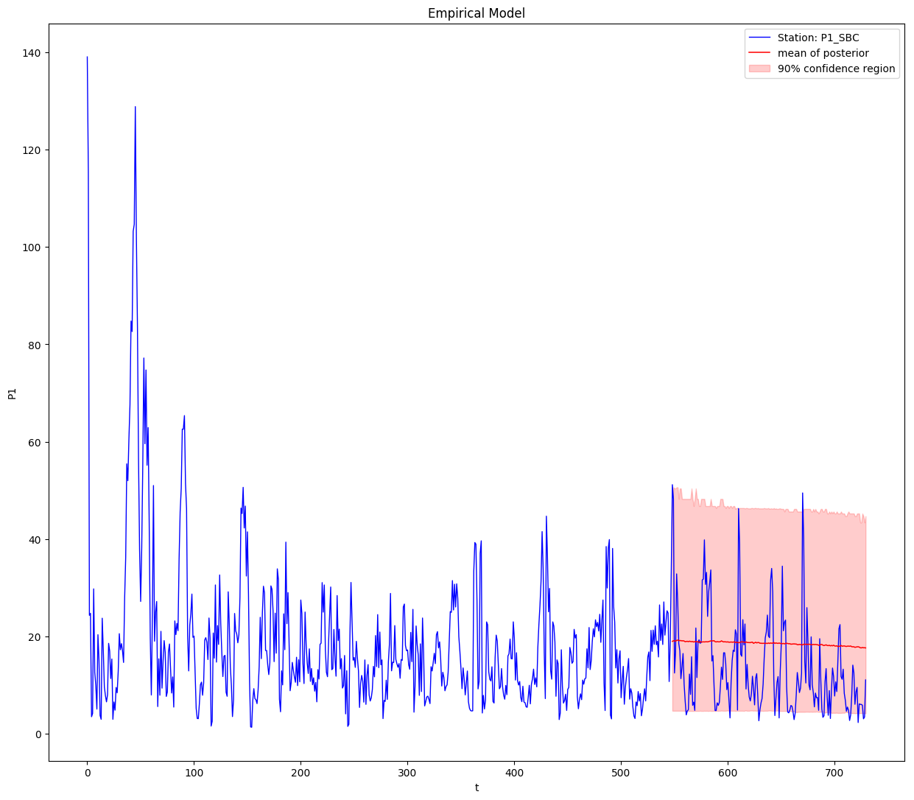

On the other hand, this is the curve of one of the MDNs. The difference is clear. This model actually tries to approximate the observed value. Where the value cannot be approximated by the expected value, the distribution is wider. Thus the observation is still modelled, although the uncertainty is large. Of course, the model is not perfect. On the test set the results are much better, which implies overfitting.

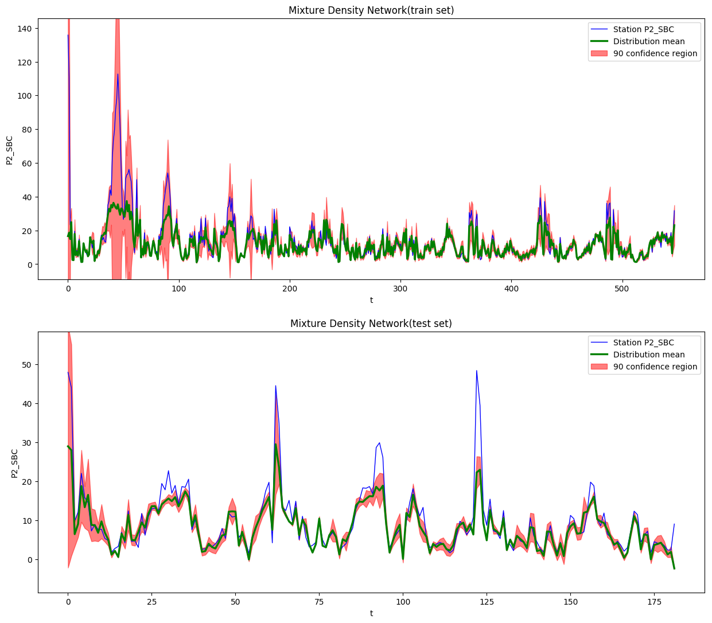

The results for the BNNs are quite similar. Here we also see something like overfitting. With the Train Set you can hardly see the blue curve, because the model models it quite well. But this is not the case with the test set. There you can see quite a lot of places where the model can&rsquo;t guess the observation. Nevertheless, it is also obvious that the distributions are not random and correspond reasonably to the real observation.

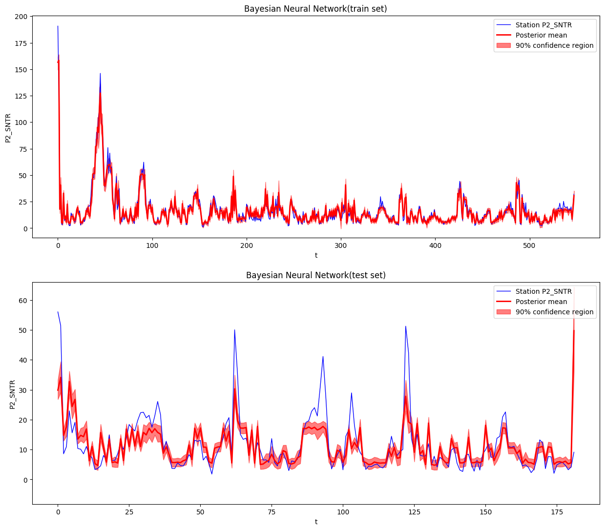

## Results: plots

More precisely you can see the quality of the models with the next plots. With them we directly compared some models. Remark: this is about models that model data averaged over one hour. Another remark: smaller scores are better. As already mentioned, we only consider CRPS values. Rows represent different LUBW stations that are predicted. The columns are the two fine dust values - PM10 and PM2.5.

If we take a closer look at the station SBC - you can quickly see that even without LUBW data the MDNs are better than the baseline. The MNDs stay better in all cases. On the other hand, if you look at the prediction for PM10, the BNN is worse than the empirical model if no values from LUBW sensors were used as features. Our guess is that BNNs are more or less &ldquo;sensitive&rdquo; to &ldquo;information loss&rdquo;.

The scores for the SAKP station, if you think about it a bit, you understand that something is not quite right. Reminder, SAKP was the &ldquo;bad&rdquo; LUBW station without complete data. In the picture you notice that nothing changes. The MDNs are better than the Empirical Model, but this must be somehow random, because we know that this station is not really predictable. The data is interpolated. If you check the model curve, you understand why these results occurred. The distribution is broad and includes all &ldquo;observations&rdquo; (interpolated values). As with the empirical model, this is true modeling, but it doesn&rsquo;t tell us anything.

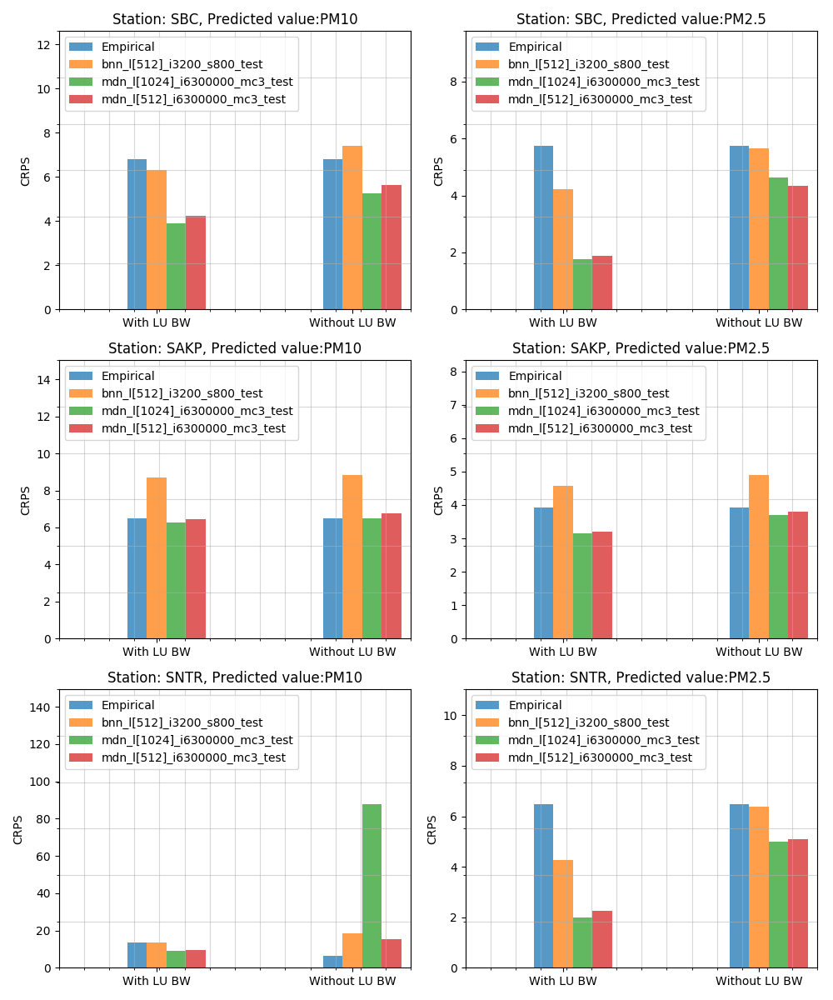

## Results: Rank Histograms

Next we have two rank histograms, which clearly show us the problems with the models. The histograms have the shape of a &ldquo;U&rdquo;. This means that the generated distributions are either completely left or right of the observation. In both cases, the observation is not in the distribution. This of course is not so nice, but this is what the results are.

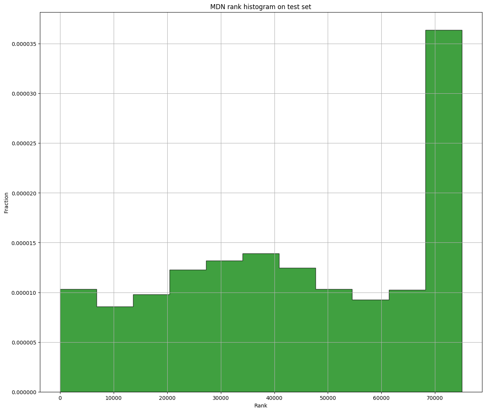

## Results: Feature Importance

Finally we come to Feature Importance. Again, we don&rsquo;t have time for all Feature Importance plots now. This is one that compares models for the PM10 value of SBC. Above are the models that use the other two LUBW sensors and below are those that don&rsquo;t use LUBW data. At first glance everything looks confusing. One thing that is obvious, however, is that here the 146 sensor is consistent for all models of no importance. This is indeed interesting and the conclusion (or rather the guess) would be &ldquo;The Sensor 146 is particularly bad because the models take very little information from it&rdquo;. Something else that is noticeable, here above, all models put a big information value on the LUBW sensor SNTR. This is to be expected, of course. What is not to be expected is that SAKP also has an information value that is not zero. But we suspect that this is somehow random or some random correlation between the predicted values and the interpolated values of SAKP has been found. In any case, this result is to be considered as an outlier.

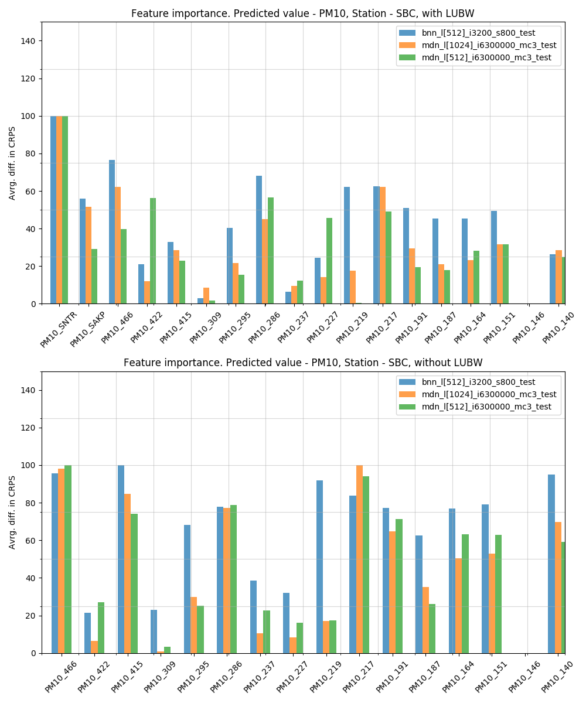

# Conclusion

And so I come to the end. We have seen that in certain situations the built models can reach the set goals. Also, more or less the Feature Importance data shows what we wanted - something consistent about some models. Of course, there are possibilities for further development. In any case, you can train models with better scores if you play with the hyper parameters.

Thank you for your attention.

# Table of Contents

1.  [Motivation](#org89668ea)
2.  [Data](#orgd81ac5b)
3.  [System](#org48dfa18)
4.  [Goals and not goals](#org875bc86)
5.  [Stochastic Regression Models](#org23e61ae)
    1.  [Concrete models](#org68bafb4)
6.  [Evaluation of probability distributions](#org7ec1c77)
    1.  [Proper Scoring Rules](#org1f95328)
    2.  [Verification Rank Histograms](#orge0c096a)
    3.  [Feature importance](#org4aeab79)
7.  [Training](#orgf1749e4)
    1.  [Results: curves](#orgb090b29)
    2.  [Results: plots](#org993d8e0)
    3.  [Results: Rank Histograms](#org63ddf24)
    4.  [Results: Feature Importance](#orgb9e4077)
8.  [Conclusion](#orgcc4c981)
